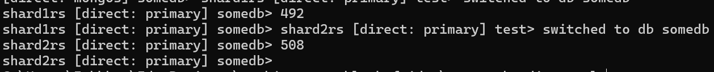

# pymongo-api

## Как запустить

Запускаем mongodb и приложение

```shell
docker compose up -d
```

Заполняем mongodb данными

```shell
./scripts/mongo-init.sh
```

## Как проверить

Консоль выведет количество документов на каждом из шардов, к примеру:


Можно зайти в FastApi и отправить Rest запросы http://localhost:8080/docs (collection_name = helloDoc)